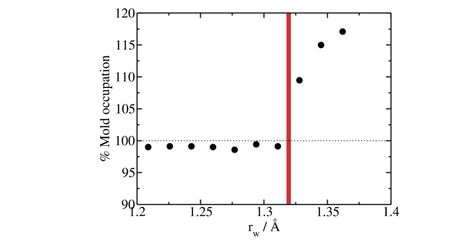
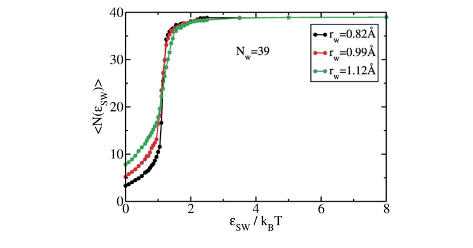
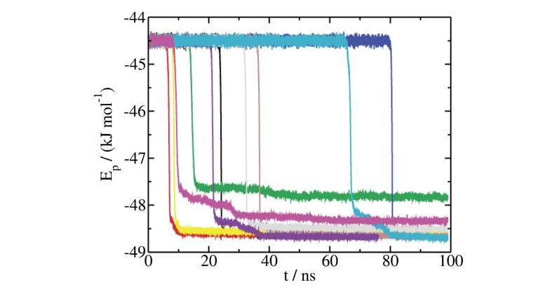

# Lattice mold calculations of mW Ice Ih nucleation rate at T=220K

````{note}
In this section `/` is the package's root folder.
````
Here we provide a detailed instructions to calculate the nucleation rate of Ice Ih with the mW model at $T=220K$ and $p=1bar$ using the Lattice Mold technique that requires the `square/well pair_style` available in LAMMPS. 

The data file (`39mold.xyz`), the potential file for mW (`mW.sw`) and LAMMPS script (`mw_lattmold.in`) are provided in the directory `/examples/mw_mold/` and in this work example we will navigate through those files to explain them in detail.

````{note}
The mW pair style is part of the MANYBODY package. See the [Build package](https://docs.lammps.org/Build_package.html) page for more info.
````

The lattice mold technique consists of 5 different steps. All the steps can be found in {footcite:t}`sanchez2022homogeneous`, and they can be summarized as:  

1. Create an appropriate spheroidal mold and embed it in the liquid at the correct density
2. Choice of the optimal well radius $r_{w,0}$ to extrapolate, in the limit where two water molecules fit inside the same well.
3. Calculation of the [well occupancy](#well-occupancy) curves for each well depth below the optimal radius. 
4. Calculation of the [average nucleation time](#average-nucleation-time) to obtain the nucleation rate at each well radius.
5. [Extrapolation of the nucleation rate](#extrapolation-of-the-nucleation-rate) to the optimal radius $r_{w,0}$.

The configuration (step 1) can be created easily using the liquid and crystal configuration at the corresponding $(p,T)$ conditions for the desired Ice (Ih in this example). Here, we provide the system data file of a mold made of 39 wells at $T=220K$ and $p=1bar$ (see the figure below). 


The optimal radius is easily calculated by running a simulation of a single well and sweeping the well radii for a fixed depth of $\sim8k_BT$. The radius above which the occupancy exceeds the 100%, *i.e.* more than one water molecule can access the well, is considered as the optimal radius. For the current example we have to extrapolate to $r_{w,0}=1.32Å$ (see figure below).




## Well occupancy 

The calculation of the well occupancy for different well radii under the optimal well radius consists of the following steps:

1. Create the directory for sweeping different radii ($r_w=0.85,0.99,1.12Å$), and in each directory, create a for each well depth considered for the calculation. This is a truncated range of values of $\epsilon$ in $k_{B}T$:

```
0.00001
0.10
0.20
...
2.4
2.5
3.5
5.0
8.0
```
Please note that the number of well depths included in the calculation may increase to capture with more accuracy the transition of well filling. This should vary with the well radius.

2. Copy the LAMMPS script file (`mw_lattmold.in`) in each subdirectory along with the configuration file (`39mold.xyz `) and the mW potential file (`mW.sw`).
3. The LAMMPS script contains several variables that are important to know to properly perform the simulations:

```
# ---------------------------- Define variables --------------------------------
variable  nts          equal  99000000   # production number of time-steps
variable  T            equal  220.0      # Temperature of the system in K
variable  nkT          equal  8          # Well depth in kT
variable  ts           equal  1          # length of the ts (in fs units)
variable  width        equal  0.25       # (reduced) width of the square well potential
variable  alpha        equal  0.017025   # exponent of the square well potential (0.005*3.405)
variable  seed         equal  23782      # velocity seed
variable  NtsTdamp     equal  100        # Number of ts to damp temperature
variable  thermoSteps  equal  1000       # Number of ts to write properties on screen
variable  restartSteps equal  1000000    # Number of ts before write restart file
variable  dumpSteps    equal  250000     # Number of ts before write dump file


# --------------------- Derivate variables -------------------------------------
variable D           equal ${nkT}*8.314*$T/4184    # Depth of well (real units)
variable rw          equal ${width}*3.405          # Width of the well (real units)
variable cutoff_well equal  ${rw}*4.0              # Well potential cutoff (real units)


####   Define Mold   ####
read_data      39mold.xyz  # contains the positions and masses and other information
group freeze type 2 
group unfrozen subtract all freeze

```

For this step, the typical run must be approximately 5 ns (with `dt=1 fs`), and that can be controlled by the parameter `nts` which must be set to `nts=5000000`. 
Regarding the interaction potential, the parameter `width` stands for the well radius so this must be changed for the different studies radii during this step `width=0.25,0.29,0.33` in reduced units. 
The parameter `nkT` gives the well depth in $k_BT$  and must sweep the values presented above. 
Regarding the velocity seed, the variable `seed` controls the initial velocity seed. 
Also, there are some variables that might be interesting to know: 
- `thermoSteps` gives the number of timesteps to print the thermos. 
- `restartSteps` indicates the frequency of saving the restart files.
- `dumpSteps` is the number of steps to save the trajectory in the dump file and for this step can be set above 200000 as it is not required in this step.


5. Launch the simulation for each radius and well depth.
6. The `thermo_style` is configured to show some magnitudes that are crucial for the calculation of the well occupancy curves. We need to get the average number of well occupancy for each value of `nkT` so that we print the potential contribution due to mW-well interaction (`c_1`, column 8):

```
# ------------- Output thermo information and averaged variables ---------------
compute 1 all pair square/well
compute 2 all pair sw
compute mytemp unfrozen temp
thermo_style   custom step c_mytemp pe etotal press vol enthalpy c_1 c_2 spcpu  # energy and thermo properties printed to output
thermo_modify  flush yes  # flush the buffer and write the output in real time
thermo         ${thermoSteps}      # how often (in steps) will write the properties of thermo_style to the output
```

Thus, the calculation of the well occupancy for each depth can be estimated easily by taking the average over all the simulation of this value:
  
$$\langle Nw \rangle=4184\cdot c_1 /(nkT\cdot 8.314\cdot T)$$

6. Plot the different curves of well occupancy for the different radii. The result should look similar to the figure below



The free energy difference between the liquid and the liquid with the precritical cluster is calculated as 

$$\Delta G^*=N_w\cdot\epsilon_{max}-\int_{\epsilon_0}^{\epsilon_{max}}d\epsilon_{sw}\, \langle N_{sw}(\epsilon_{sw})\rangle,$$

where $N_{w}$ is the total number of wells in the mold ($39$), $\epsilon_{max}$ is the maximum well depth to evaluate this integral, 
$\langle N_{sw}(\epsilon_{sw})\rangle$ is the average number of mold sites occupied by liquid molecules obtained previously, 
and $\epsilon_0$ is the minimum value of epsilon considered in the calculation (close to zero). 
The final calculation of the free energy difference must include the rotational and translational degrees of freedom such that

$$\Delta G/k_B T=\Delta G^*/k_B T + \ln(\rho_f V_w)- \ln(8\pi^2),$$

where $\rho_f$ is the fluid number density, and $V_w$ is the volume of a single well.
The free energy difference is used to calculate the probability per unit volume of finding a crystal cluster of the size of the one induced by the mold as dictated by the following equation:

$$P=\rho_f \exp(-\Delta G/(k_B T)) .$$


## Average nucleation time 

To estimate the average nucleation time, one must follow these steps:

1. Create the directory for sweeping different radii ($r_w=0.85,0.99,1.12Å$).
2. For each radius one needs to run different independent velocity seeds. Create 10 directories for each radius directory.
3. Copy the LAMMPS script file (`mw_lattmold.in`) in each subdirectory along with the configuration file (`39mold.xyz `) and the mW potential file (`mW.sw`).
4. The variables of the LAMMPS script presented in previous section need to be changed slightly. For this step, the typical run must be of the order of $100ns$ (with `dt=1 fs`), controlled by the parameter `nts` which must be set to `nts=10000000`. The well depth `nkT` must be set to 8. Importantly, for this step the `seed` variable must be change for every independent run.
5. Launch the simulation for each radius and independent velocity seed.
6. The `thermos_style` provides the potential energy (`pe`) in column 2 which is the variable used to determine the average nucleation time of the precritical mold used in this example. Plot the variable `pe` vs the time that correspond to multiply the `step` variable (column 1 in `thermo`) by the `timestep` ($1fs$). 
The sharp decay in the curves determine the nucleation time that averaged over all seeds provides the estimation for all the seeds as shown in the figure below




````{warning}
Some seeds may need to run longer times in case the mold has not been able to nucleate. 
````


## Extrapolation of the nucleation rate 


The extrapolation of the nucleation rate is straitghforward. 
- The nucleation rate is calculated as

$$J=P/\langle t\rangle,$$

where $P$ is the probability calculated in [Step 3](#well-occupancy) and $\langle t\rangle $ is the average nucleation time obtained in [Step 4](#average-nucleation-time). 
- Plot the nucleation rates vs the well radii using logarithmic scale in the y-axis as in the figure below.


 
- Fit the data to a linear function
- Use the resulting fit equation to extrapolate the nucleation rate to the optimal radius ($J(r_{w,0}=1.32Å)$)
The table below provides the obtained free energy, average nucleation time and nucleation rate for each well radius. 

|         $r_w/Å$)        |  0.85 |  0.99 |  1.12 |
|:----------------------------:|:-----:|:-----:|:-----:|
| $\Delta G/k_B T$       | 31.21 | 28.80 | 27.38 |
| $\langle t\rangle (ns)$ |  9.8  |  16.2 | 29.1 |
| $\log_{10}J$            |  23.0 |  23.8 |  24.2 |


Extrapolating the nucleation rate to the optimal radius gives $\log_{10}J(r_{w,0}=1.32Å)=25.3(2.5)$ for ice Ih of mW at $T=220K$ and $p=1bar$


```{footbibliography}

```
