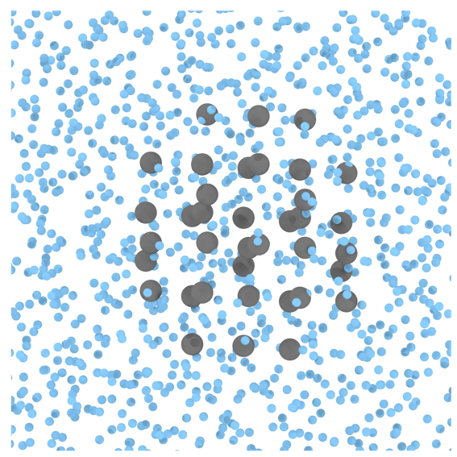
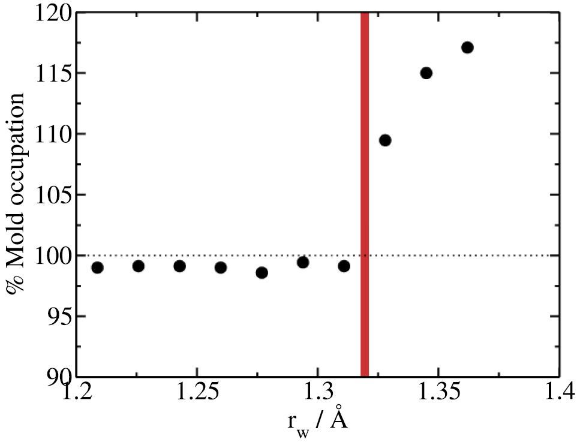
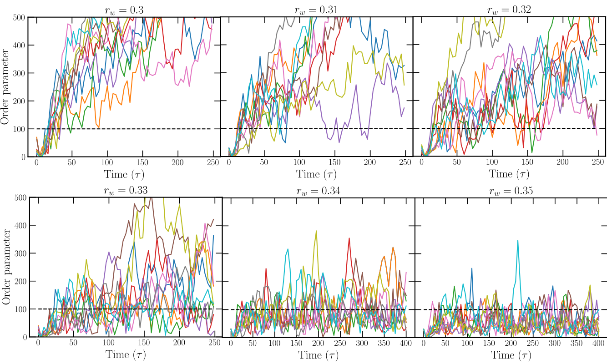
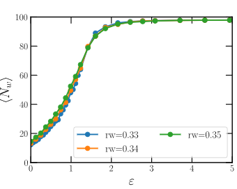
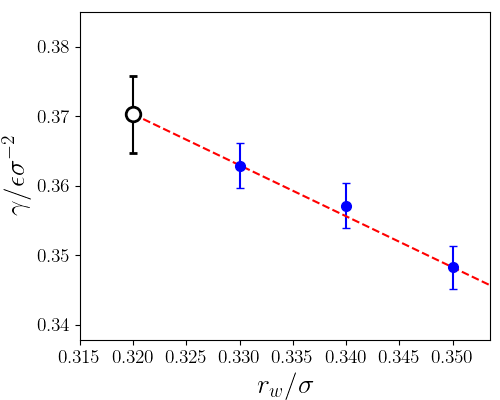

# Lattice mold calculations of mW Ice Ih nucleation rate at T=220K

````{note}
In this section `/` is the package's root folder.
````
Here we provide a detailed instructions to calculate the nucleation rate of Ice Ih with the mW model at $T=220K$ and $p=1bar$ using the Lattice Mold technique that requires the `square/well pair_style` available in LAMMPS. 

The data file (`39mold.xyz`), the potential file for mW (`mW.sw`) and LAMMPS script (`mw_lattmold.in`) are provided in the directory `/examples/mw_mold/` and in this work example we will navigate through those files to explain them in detail.

````{note}
The mW pair style is part of the MANYBODY package. See the [Build package](https://docs.lammps.org/Build_package.html) page for more info.
````

The mold integration technique consists of different steps and here we only discuss the last two steps to obtain the interfacial energy of the 100 plane for the LJ particles at $T^\ast=0.617$ and $p^\ast=-0.02$. All the steps can be found in {footcite:t}`espinosa2014mold`, and they can be summarized as: 

1. Preparation of the configuration by embedding the mold coordinates (from a crystal configuration) into the fluid at coexistence conditions.
2. Choice of the [optimal well radius](#optimal-radius-calculation) $r_{0w}$ to extrapolate the interfacial energy.
3. [Thermodynamic integration](#thermodynamic-integration) to calculate the interfacial energy for different well radii above the optimal radius
  $\gamma(r_{0w}>r_w)$. 
4. Extrapolation of the interfacial energy to the optimal radius $r_{0w}$.

The configuration (step 1) can be created easily using the liquid and crystal configuration at the corresponding $(p,T)$ conditions. In this example, we provide the system data file for the plane 100 of a LJ particles at $T^\ast=0.617$ and $p^\ast=-0.02$:







## Optimal radius calculation 

The calculation of the optimal radius for extrapolation of the interfacial energy includes the following steps:

1. Create a directory sweeping different radii ($r_w=0.27,\ 0.28,\ \ldots,0.33,0.34\sigma$). 

```
0.00001
0.10
0.20
...
2.4
2.5
3.5
5.0
8.0
```

2. For each radius one needs to run different independent velocity seeds. Create 10 directories for each radius directory.
3. Copy the LAMMPS script file (`lj_mold.in`) in each subdirectory along with the configuration file (`mold_100.lmp`).
4. The LAMMPS script contains several variables that it is important to know to properly perform the simulations:
```
# ---------------------------- Define variables --------------------------------
variable  nts          equal  400000     # production number of time-steps
variable  ts           equal  0.001      # length of the ts (in lj units)
variable  siglj        equal  1.0        # sigma coefficient for BG pair-style
variable  epslj        equal  1.0        # epsilon coefficient for BG pair-style
variable  cut1         equal  2.3        # internal cut-off for BG pair-style
variable  cut2         equal  2.5        # external cut-off for BG pair-style
variable  rw           equal  0.33       # (reduced) width of the square well potential
variable  alpha        equal  0.005      # exponent of the square well potential
variable  nkT          equal  8.0        # well depth (reduced units) 
variable  seed         equal  23782      # velocity seed
variable  Tsyst        equal  0.617      # (reduced) temperature of the system
variable  Psyst        equal  -0.02      # (reduced) press of the system
variable  NtsTdamp     equal  100        # Number of ts to damp temperature
variable  NtsPdamp     equal  100        # Number of ts to damp pressure
variable  thermoSteps  equal  1000       # Number of ts to write properties on screen
variable  restartSteps equal  30000      # Number of ts before write restart file
variable  dumpSteps    equal  5000       # Number of ts before write dump file

# --------------------- Derivate variables -------------------------------------
variable cutoff1     equal  ${siglj}*${cut1}
variable cutoff2     equal  ${siglj}*${cut2}
variable cutoff_well equal  ${rw}*4.0
variable D           equal  ${nkT}*${Tsyst} # Depth of well
variable Tdamp       equal  ${NtsTdamp}*${ts}
variable Pdamp       equal  ${NtsPdamp}*${ts}


####  Define mold  ####
read_data       mold_100.lmp
group melt type 1
group mold type 2

```
For this step, the typical run must be approximately 200000 time-steps (with dt=1e-3), and that can be controlled by the parameter `nts`. 
Regarding the interaction potential, the parameter `rw` stands for the well radius so this must be changed for the different studies radii during this step `rw`=$0.27,\ 0.28,\ \ldots,0.33,0.34\sigma$. 
The parameter `nkT` gives the well depth in $k_{B}T$ units and for this step must be kept to 8 or bigger. 
Regarding the velocity seed, the variable `seed` controls this aspect and thus, it must be changed with a random integer number for each simulation. 
Also, there are some variables that might be interesting to know:
- `thermoSteps` gives the number of timesteps to print the thermo
- `restartSteps` indicates the frequency of saving the restart files
- `dumpSteps` is the number of steps to save the trajectory in the dump file and for this step it is recommended to be set to 2000.

5. Launch the simulation for each radius and seed. That means a total of 80 simulations, but they are quite short. 

6. The analysis of this step consists in determining if there is induction time, *i.e.* if that radius can be thermodynamically integrated. To do so, the resulting trajectory must be analyzed using the order parameter ${\bar{q}}_6$ to determine the number of particles on the cluster. 
The recommended values for such analysis is a threshold of ${\bar{q}}_6=0.34$, and a cutoff of $1.35\sigma$. As a result, one obtains different curves for the order parameter as a function of time for the different well radii:



A system can be considered to be integrated if the order parameter remains close to the total number of molds within the system (98 wells for this example). Therefore, in this case we can consider $r_w=0.32\sigma$ as the greatest radius with not sufficiently long induction time so it is chosen as our optimal radius to extrapolate.

## Thermodynamic integration 

Once the optimal radius is estimated, the next step consists in thermodynamic integration of different radii above the optimal value of $r_w$. The calculation of the interfacial energy for the different well radii includes the following steps:

1. Create a directory for each radius to be integrated ($r_w=0.33,0.34,0.35\sigma$) and in each directory, create a for each well depth considered for the calculation. This is a truncated range of values of $\epsilon$ in $k_{B}T$:

```
0.00001
0.1
0.2
...
1.9
2.0
2.3
2.6
3
3.5
4
4.5
5
6
7
8
```

2. Copy the LAMMPS script file (`lj_mold.in`) in each subdirectory along with the configuration file (`mold_100.lmp`).

3. The variables of the LAMMPS script presented in previous section need to be changed slightly. For this step, the typical run must be of the order of hundred of thousands time-steps (with `dt=1e-3`), controlled by the parameter `nts`. Regarding the interaction potential, the parameter `rw` that controls the well radius must be changed for the different radii `rw=0.33,0.34,0.35` (in $\sigma$). The parameter `nkT` (well depth) must change it for each simulation with the corresponding value. Also, the `thermoSteps` should have a reasonable value (1000 is recommended), and `dumpSteps` can be set above 50000 timesteps as the trajectory is not needed for this step

4. Launch the simulation for each radius and well depth. 

5. The `thermo_style` is configured to show some magnitudes that are crucial for the thermodynamic integration. We need to get the average number of well occupancy for each value of `nkT` so that we print the potential contribution due to LJ particle-well interaction (`c_1`, column 13), but also the number of particles in the system (`v_nall`, column 15) since the energy is expressed in reduced LJ units, *i.e.* energy per particle instead of energy of the total system:

```
# ------------- Output thermo information and averaged variables ---------------
variable well equal c_1*count(all)
variable nall equal count(all)
compute mytemp melt temp
compute 1 all pair square/well
thermo    ${thermoSteps}
thermo_style  custom step pe epair press ke c_mytemp lx ly lz pxx pyy pzz c_1 v_well v_nall spcpu density
```


````{note}
For real units the multiplication by the number of particles in the system is not necessary.
````

The calculation of the well occupancy for each depth can be estimated easily by taking the average over all the simulation of this value:

$$\langle Nw \rangle=c_1\cdot n_all/(nkT\cdot T)$$


````{note}
Please note that the system requires a time to reach the steady state so that the analysis must be performed discarding after $t\approx10\tau$. This equilibration time may vary depending on the system under study (water, hard-spheres, salt…)
````

In the following figure the curves of well occupancy vs. well depth for the different radii are presented.




## Extrapolation and interfacial energy calculation

After the analysis in the previous step, one obtain a curve of well occupancy vs well depth for each radius so that the interfacial energy is calculated as

$$\gamma(r_w )=\frac{1}{2l^2 } \left[N_w\cdot\epsilon_{max}-\int_{\epsilon_0}^{\epsilon_{max}}d\epsilon\, N_w(\epsilon) \right],$$
where $N_w$ is the total number of wells and $l$ is the short side of the box that can be obtained from the thermo (`lx`, `ly`, columns 7 and 8 int the `thermo`). The resulting integrals are provided in the following table:

|         $r_w/\sigma$)        |  0.33 |  0.34 |  0.35 |
|:----------------------------:|:-----:|:-----:|:-----:|
| $\gamma/\sigma^{-2}\epsilon$ | 0.363 | 0.357 | 0.348 |

To obtain the interfacial energy, you now shall extrapolate the value of the interfacial energy to the optimal radius ($r_{0w}=0.32\sigma$) using a linear fit. According to the interfacial energy provided in the table the interfacial energy is

$$\gamma=0.370(8) \epsilon\sigma^{−2}$$



This mold integration reported for the same system an interfacial energy of $\gamma=0.372(8) \epsilon\sigma^{−2}$ extrapolating to an optimal radius of $r_{0w}=0.315\sigma$ (please see the work by Espinosa *et al*{footcite:t}`espinosa2014mold`). Additionally, another work using the cleaving technique{footcite:t}`davidchack2003direct` reported a value of $\gamma=0.371(3) \epsilon\sigma^{−2}$ for the same system.


```{footbibliography}

```
