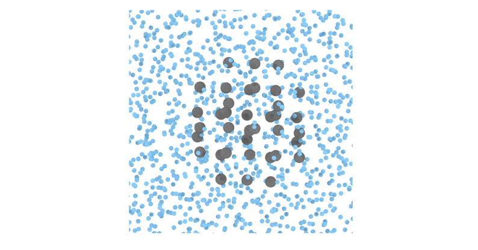

# Lattice mold calculations of mW Ice Ih nucleation rate at T=220K

Here we provide a detailed set of instructions to calculate the nucleation rate of ice Ih with the mW coarse-grained water model at $T=220K$ and $p=1bar$ using the Lattice Mold technique (see {footcite:t}`espinosa2016lattice` and {footcite:t}`sanchez2022homogeneous`) that requires the `square/well pair_style` available in LAMMPS.

The data file (`39mold.lmp`), the potential file for mW (`mW.sw`) and LAMMPS script (`mw_lattmold.in`) are provided in the directory `/examples/mw_mold/` (see [here](https://github.com/AndresRTejedor/Mold/tree/main/example/mw_mold)). 
In this worked example we will navigate through these files to explain them in detail.

````{note}
The mW pair style is part of the MANYBODY package. See the [Build package](https://docs.lammps.org/Build_package.html) page for more info.
````

The lattice mold technique consists of 5 different steps. All the steps can be found in {footcite:t}`sanchez2022homogeneous`, and they can be summarized as:  

1. Create an appropriate spherical mold with the perfect structure of the crystal Ih ice and embed it in the liquid at the equilibrium density at the conditions of interest.
2. Choice of the optimal well radius $r_{w,0}$ for obtaining the nucleation rate, *i.e.* the limit for which two water molecules fit inside the same well.
3. Calculate the [well occupancy curves](#well-occupancy-curves) for several radii below the optimal one. 
4. Calculate the [average nucleation time](#average-nucleation-time) for each well radius to overcome the nucleation free energy barrier.
5. [Extrapolation of the nucleation rate](#extrapolation-of-the-nucleation-rate) to the optimal radius $r_{w,0}$.

The configuration (step 1) can be easily created using the bulk liquid and crystal configurations at the corresponding $(p,T)$ conditions for the desired ice phase (Ih in this example). 
Please note that the perfect crystal structure must be used to generate the mold potential well using the equilibrium density at the given conditions. 
Here, we provide the system data file of a mold made of 39 wells at $T=220K$ and $p=1bar$ (see the figure below where blue particles represent water molecules and gray particles the mold wells). 
The number of wells in the mold is chosen so that the system displays induction time to permit reversible thermodynamical integration of the precritical cluster, but still it is able to overcome the free energy nucleation barrier and eventually crystallize in a reasonable computational time.



The optimal radius is calculated by running a simulation of a single well and sweeping the well radii for a fixed depth of $8k_BT$. 
The largest value of the radius at which the occupancy is still below $100\%$ at a depth of $8k_BT$ is considered to be the optimal radius.
For well radius larger than the optimal one, two or more particles can enter in a well. Please note that for the lattice mold technique a extrapolation is performed to a larger value of the radius than that used in the calculation (in contrast with the [mold integration method](https://andresrtejedor.github.io/Mold/example_MI_lj.html#))
For the current example we extrapolate to $r_{w,0}=1.32Å$ (see figure below, red vertical line).


## Well occupancy curves

The calculation of the well occupancy for different well radii under the optimal radius consists of the following steps:

1. Create the directory for sweeping different radii ($r_w=0.85,0.99,1.12Å$), and within each directory, create a directory for each well depth considered for the calculation. 
This is a truncated range of values of $\epsilon$ in $k_{B}T$:

```
0.00001
0.10
0.20
...
1.4
1.5
1.75
2.0
2.5
3.0
4.0
5.0
8.0
```
Please note that the grid of well depths included in the calculation may need to be increased to capture the transition of well filling with more accuracy. Also, for different well radii the grid may change.

2. Copy the LAMMPS script file (`mw_lattmold.in`) in each subdirectory along with the configuration file (`39mold.lmp`) and the mW potential file (`mW.sw`).
3. The LAMMPS script contains several variables that are important to know to properly perform the simulations:

```
# ---------------------------- Define variables --------------------------------
variable  T            equal  220.0      # Temperature of the system in K
variable  nkT          equal  8          # Well depth in kT
variable  ts           equal  1          # length of the ts (in fs units)
variable  width        equal  0.25       # (reduced LJ) width of the square well potential
variable  alpha        equal  0.017025   # Parameter for the slope of the square well potential (0.005*3.405)
variable  seed         equal  23782      # velocity seed
variable  NtsTdamp     equal  100        # Number of ts to damp temperature
variable  thermoSteps  equal  1000       # Number of ts to write properties on screen
variable  restartSteps equal  1000000    # Number of ts before write restart file
variable  dumpSteps    equal  50000      # Number of ts before write dump file
variable  nts          equal  100000     # production number of time-steps


# --------------------- Derivate variables -------------------------------------
variable D           equal ${nkT}*8.314*$T/4184    # Depth of well (real units)
variable rw          equal ${width}*3.405          # Width of the well (real units)
variable cutoff_well equal  ${rw}*4.0              # Well potential cutoff (real units)


####   Define Mold   ####
read_data      39mold.lmp  # contains the positions and masses and other information
group freeze type 2 
group unfrozen subtract all freeze

```

For this step, the typical run must be approximately 5 ns (with `dt=1 fs`), and that can be controlled by the parameter `nts` which must be set to `nts=5000000`. 
Regarding the interaction potential, the parameter `width` stands for the well radius so this must be changed for the different studied radii during this step `width=0.25,0.29,0.33` in reduced units (please note that for using reduced units of distance we employ $\sigma=3.405$ which does not necessarily correspond to the $\sigma$ in the water model). 
The parameter `nkT` gives the well depth in $k_BT$  and must sweep the values presented above. 
Regarding the velocity seed, the variable `seed` controls the initial velocity seed. 
Also, there are some variables that might be interesting to know: 
- `thermoSteps` gives the number of timesteps to print the thermos. 
- `restartSteps` indicates the frequency of saving the restart files.
- `dumpSteps` is the number of steps to save the trajectory in the dump file and for this step can be set above 200000 as it is not required in this step.


5. Launch the simulation for each radius and well depth.
We provide a bash file `/utils/LM/1.Integral/Runwsh` that creates the directory for each well depth and run the simulations, reading the file `/utils/LM/1.Integral/list` that contains all the well depths. 
The bash script contains the following variables:
```
T='240'
Nw='39'
rw='0.25'
steps=5000000
dump='200000'
path='../../'
```
- `T`: temperature of the system
- `Nw`: number of wells in the mold
- `rw`: well radius
- `steps`: number of steps 
- `dump`: frequency to save the trajectory (in simulation steps) 
- `path`: path to `mw_latt mold.in`, mW.sw, and `39mold.lmp`. Absolute path is highly recommended.
Also,  the bash file includes a submission command `sbatch LAMMPS.job`, but LAMMPS.job is not provided as it depends on the user machine. 

6. The `thermo_style` is configured to show some magnitudes that are crucial for the calculation of the well occupancy curves. 
We need to get the average number of well occupancy for each value of `nkT` so that we print the potential contribution due to mW-well interaction (`c_1`, column 8):

```
# ------------- Output thermo information and averaged variables ---------------
compute 1 all pair square/well
compute 2 all pair sw
compute mytemp unfrozen temp
thermo_style   custom step c_mytemp pe etotal press vol enthalpy c_1 c_2 spcpu  # energy and thermo properties printed to output
thermo_modify  flush yes  # flush the buffer and write the output in real time
thermo         ${thermoSteps}      # how often (in steps) will write the properties of thermo_style to the output
```

Thus, the calculation of the mold occupancy for each well depth can be estimated by taking the average over the production (after equilibration) simulation time through this equation:
  
$$\langle Nw \rangle=4184\cdot c_1 /(nkT\cdot 8.314\cdot T)$$

Please note that the temperature must be recalculated to consider only the water molecules in the simulation box, since the LAMMPS `thermo` considers all the particles to evaluate the system temperature. This only applies for calculations in real units.

In `/utils/LM/1.Integration/`, we provide the python program `PyIntegral.py` that can be run to get the well occupancy curve for each well depth. 
The script must be run in the directory where you run the `Run.sh` bash file. The program outcome is a file called `fill.txt` that contains the results for the well occupancy.


7. Plot the different curves of mold occupancy as a function of the well depth for the different radii. The result should look similar to the figure below


The free energy difference between the liquid and the liquid with the precritical cluster is calculated as 

$$\Delta G^*=N_w\cdot\epsilon_{max}-\int_{\epsilon_0}^{\epsilon_{max}}d\epsilon_{sw}\, \langle N_{sw}(\epsilon_{sw})\rangle,$$

where $N_{w}$ is the total number of wells in the mold ($39$), $\epsilon_{max}$ is the maximum well depth to evaluate this integral ($8k_BT$), 
$\langle N_{sw}(\epsilon_{sw})\rangle$ is the average number of mold sites occupied by liquid molecules as a function of $\epsilon_{sw}$, 
and $\epsilon_0$ is the minimum value of epsilon considered in the calculation. 
The final calculation of the free energy difference must include the rotational and translational degrees of freedom such that

$$\Delta G/k_B T=\Delta G^*/k_B T + \ln(\rho_f V_w)- \ln(8\pi^2),$$

where $\rho_f$ is the fluid number density, and $V_w$ is the volume of a single well.
This magnitude can be calculated with the program `utils/LM/1.Integral/post.py`, that reads the file `fill.txt` obtained by running the script `PyIntegral.py`. Only the value of $rho_f$ must be adjusted for each system.
The free energy difference is used to calculate the probability per unit volume of finding a crystal cluster of the size of the one induced by the mold as dictated by the following equation:

$$P=\rho_f \exp(-\Delta G/(k_B T)) .$$


## Average nucleation time 

To estimate the average nucleation time, one must follow these steps:

1. Create the directory for sweeping different radii ($r_w=0.85,0.99,1.12Å$).
2. For each radius one needs to run different independent velocity seeds. Create 10 directories for each radius directory.
3. Copy the LAMMPS script file (`mw_lattmold.in`) in each subdirectory along with the configuration file (`39mold.lmp`) and the mW potential file (`mW.sw`).
4. The variables of the LAMMPS script presented in previous section need to be changed slightly. For this step and this particular system, the typical run must be of the order of $100ns$ (with `dt=1fs`), controlled by the parameter `nts` which must be set to `nts=10000000`. 
The well depth `nkT` must be set to 8. Importantly, for this step the `seed` variable must be changed for every independent run.
5. Launch the simulation for each radius and independent velocity seed.
6. The `thermos_style` provides the potential energy (`pe`) in column 2 which is the variable used to determine the average nucleation time of the precritical mold used in this example. 
Plot the variable `pe` vs the time that correspond to multiply the `step` variable (column 1 in `thermo`) by the `timestep` (1fs). 
The sharp decay in the curves determine the nucleation time that averaged over all seeds provides the estimation for all the seeds as shown in the figure below


````{warning}
Some seeds may need to run longer times in case the mold has not been able to nucleate. 
Also, when not all trajectories exhibit complete freezing after long runs, one could used the half life reaction time (*i.e.* the time required to have halfe of the 10 trajectories with complete freezing).
````


## Extrapolation of the nucleation rate 


The extrapolation of the nucleation rate is straitghforward. 
- The nucleation rate is calculated as

$$J=P/\langle t\rangle,$$

where $P$ is the probability calculated in [Step 3](#well-occupancy) and $\langle t\rangle $ is the average nucleation time obtained in [Step 4](#average-nucleation-time) for each well radius. 
- Plot the nucleation rates vs the well radii using logarithmic scale in the y-axis as in the figure below.


 
- Fit the data to a linear function
- Use the resulting fit equation to extrapolate the nucleation rate to the optimal radius ($J(r_{w,0}=1.32Å)$)
The table below provides the obtained free energy, average nucleation time and nucleation rate for each well radius. 

|         $r_w/Å$)            |    0.85  |    0.99   |   1.12   |
|:---------------------------:|:--------:|:---------:|:--------:|
| $\Delta G/k_B T$            | 31.21(25)| 28.80(23) | 27.38(22)|
| $\langle t\rangle (ns)$     |  9.8(8)  |  16.2(8)  | 29.1(9)  |
| $\log_{10}(J\cdot m^{3}s)$  |  23.0(2) |  23.8(2)  |  24.2(3) |


Extrapolating the nucleation rate to the optimal radius gives $\log_{10}J(r_{w,0}=1.32Å)=25.3(2.5)$ for ice Ih of mW at $T=220K$ and $p=1bar$.


```{footbibliography}

```
