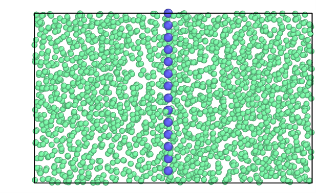

# Mold integration for 100 plane of Lennard-Jones crystal

````{note}
In this section `/` is the package's root folder.
````

Here we provide a detailed instructions to reproduce the crystal fluid interfacial free energy using the BG and `square/well pair_style` available in LAMMPS. 

The data file (`mold_100.lmp`) and LAMMPS script (`lj_moldint.in`) is provided in the directory `/examples/lj_mold/`, but in this work example we will navigate through those files to explain them in detail.

The mold integration technique consists of different steps and here we only discuss the last two steps to obtain the interfacial energy of the 100 plane for the LJ particles at $T^\ast=0.617$ and $p^\ast=-0.02$. All the steps can be found in {footcite:t}`espinosa2014mold`, and they can be summarized as: 

1. Preparation of the configuration by embedding the mold coordinates (from a crystal configuration) into the fluid at coexistence conditions.
2. Choice of the optimal well radius $r_{0w}$ to extrapolate the interfacial energy.
3. Calculation of the interfacial energy for different well radii above the optimal radius  $\gamma(r_{0w}>r_w)$. 
4. Extrapolation of the interfacial energy to the optimal radius $r_{0w}$.

The configuration (step 1) can be created easily using the liquid and crystal configuration at the corresponding $(p,T)$ conditions. In this example, we provide the system data file for the plane 100 of a LJ particles at $T^\ast=0.617$ and $p^\ast=-0.02$:



[Optimal radius calculation](#step-1)

## Optimal radius calculation 

The calculation of the optimal radius for extrapolation of the interfacial energy includes the following steps:

1. Create a directory sweeping different radii ($r_w=0.27,\ 0.28,\ \ldots,0.33,0.34\sigma$).
2. For each radius one needs to run different independent velocity seeds. Create 10 directories for each radius directory.
3. Copy the LAMMPS script file (`lj_mold.in`) in each subdirectory along with the configuration file (`mold_100.lmp`).
4. The LAMMPS script contains several variables that it is important to know to properly perform the simulations:


```{footbibliography}

```
