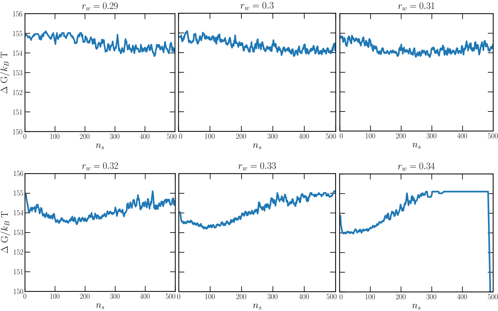

# Mold integration for the 100 plane of the fcc crystal of the Lennard-Jones potential

Here we provide a detailed set of instructions to reproduce the crystal fluid interfacial free energy using the Broughton and Gilmer (BG) Lennard-Jones (LJ) potential 
(CLEAVING package available [here](https://github.com/demonico85/cleaving/tree/master)) and `square/well pair_style` available in the current [package](https://github.com/AndresRTejedor/Mold/).

The data file (`mold_100.lmp`) and LAMMPS script (`lj_moldint.in`) are provided in the directory `/examples/lj_mold/` (see [here](https://github.com/AndresRTejedor/Mold/tree/main/example/lj_mold)). In this worked example we will navigate through these files to explain them in detail.

The Mold Integration technique consists of different steps to obtain the interfacial free energy. Here, we explain the method for the 100 plane using LJ particles at $T^\ast=0.617$ and $p^\ast=-0.02$. All the steps can be found in {footcite:t}`espinosa2014mold`, and they can be summarized as:

1. Preparation of the configuration by embedding the mold coordinates (crystal slab taken from a configuration with the equilibrium density and the perfect crystal lattice) into the fluid at coexistence conditions.
2. Choice of the [optimal well radius](#optimal-radius-calculation) $r_{w,0}$ to extrapolate the interfacial free energy.
3. [Thermodynamic integration](#thermodynamic-integration) to calculate the interfacial free energy for different well radii above the optimal radius
  $\gamma(r_{w,0}>r_w)$. 
4. Extrapolation of the interfacial free energy to the optimal radius $r_{w,0}$.

The configuration (step 1) can be easily created using the bulk liquid and crystal configurations at the corresponding $(p,T)$ conditions. In this example, we provide the system data file for the plane 100 of the fcc crystal lattice for a LJ system containing 98 wells (blue particles) and 1960 in fluid particles (green) at $T^\ast=0.617$ and $p^\ast=-0.02$. 
The following figure shows a 2D projection of the configuration file:


## Optimal radius calculation 

The calculation of the optimal well radius for extrapolation of the interfacial free energy includes the following steps:

1. Create a directory sweeping different radii ($r_w=0.27,\ 0.28,\ \ldots,0.33,0.34\sigma$).
2. For each radius one needs to run independent trajectories with different initial velocities. Create 10 directories for each radius directory (1 for each trajectory). This is included in the bash file (see bullet point 5).
3. Copy the LAMMPS script file (`lj_mold.in`) in each subdirectory along with the configuration file (`mold_100.lmp`).
4. The LAMMPS script contains several variables that are important to know to properly perform the simulations:
```
# ---------------------------- Define variables --------------------------------
variable  nts          equal  400000     # production number of time-steps
variable  ts           equal  0.001      # length of the ts (in lj units)
variable  siglj        equal  1.0        # sigma coefficient for BG pair-style
variable  epslj        equal  1.0        # epsilon coefficient for BG pair-style
variable  cut1         equal  2.3        # internal cut-off for BG pair-style
variable  cut2         equal  2.5        # external cut-off for BG pair-style
variable  rw           equal  0.33       # (reduced) width of the square well potential
variable  alpha        equal  0.005      # (reduced units) parameter for the slope of the square well potential
variable  nkT          equal  8.0        # well depth (kB*T units) 
variable  seed         equal  12345      # velocity seed
variable  Tsyst        equal  0.617      # (reduced) temperature of the system
variable  Psyst        equal  -0.02      # (reduced) press of the system
variable  NtsTdamp     equal  100        # Number of ts to damp temperature
variable  NtsPdamp     equal  100        # Number of ts to damp pressure
variable  thermoSteps  equal  1000       # Number of ts to write properties on screen
variable  restartSteps equal  30000      # Number of ts before write restart file
variable  dumpSteps    equal  5000       # Number of ts before write dump file

# --------------------- Derivate variables -------------------------------------
variable cutoff1     equal  ${siglj}*${cut1}
variable cutoff2     equal  ${siglj}*${cut2}
variable cutoff_well equal  ${rw}*4.0
variable D           equal  ${nkT}*${Tsyst} # Depth of well
variable Tdamp       equal  ${NtsTdamp}*${ts}
variable Pdamp       equal  ${NtsPdamp}*${ts}


####  Define mold  ####
read_data       mold_100.lmp
group melt type 1
group mold type 2

```
For this step, the typical run must be approximately 200000 time-steps (with dt=1e-3, in reduced LJ units), and that can be controlled by the parameter `nts`. 
Regarding the interaction potential, the parameter `rw` stands for the well radius so this must be changed for the different studied radii during this step `rw`=$0.27,\ 0.28,\ \ldots,0.33,0.34\sigma$. 
The parameter `nkT` gives the well depth in $k_{B}T$ units and for this step we use 8$k_BT$, although any value that guarantees that all the wells are filled can be also used.
Please note that very large values of `nkT` (i.e. $>15k_BT$) may require to reduce the integration time-step as the potential may become very steep.
The variable `seed` controls the velocity seed and thus, it must be changed with a random integer number for each simulation. 
Also, there are some variables that might be interesting to know:
- `thermoSteps` gives the number of timesteps to print the thermodynamic variables
- `restartSteps` indicates the frequency of saving the restart files
- `dumpSteps` is the number of steps to save the trajectory in the dump file and for this step it is recommended to be set to 2000 (be aware that low values of this parameter can produce large trajectory files).

5. Launch the simulation for each radius and seed. That means a total of 80 simulations, but they are quite short. 
We provide a bash file `/utils/MI/1.Optimal_r/Run.sh` that creates the directory for each velocity seed and run the simulations with independent trajectories, reading the file `/utils/MI/1.Optimal_r/list` that contains the number of seeds to run from 0 to 9. 
The bash script contains the following variables:
```
T='0.617'
P='-0.02'
rw='0.30'
steps=250000
kT='8'
dump=5000
path='../../'
```
- `T`: temperature of the system
- `P`: pressure of the system
- `rw`: well radius
- `steps`: number of steps 
- `kT`: well depth in $k_BT$ units (8 $k_B T$ for this step) 
- `path`: path to `lj_mold.in` and `mold_100.lmp`. Absolute path is highly recommended.
Also,  the bash file includes a submission command `sbatch LAMMPS.job`, but `LAMMPS.job` is not provided as it depends on the user machine. 


6. The analysis for this step consists in determining if there is induction time, i.e. further energy is required for the formation of the interface (see {footcite:t}`espinosa2014mold`). 
To do so, we recommend analyzing the resulting trajectory using the order parameter ${\bar{q}}_6$ ({footcite:t}`lechner2008accurate`) to determine the number of crystal-like particles in the slab. 
The recommended value for such analysis is a threshold of ${\bar{q}}_6=0.34$ to distinguish solid-like from liquid-like particles (solid-like for ${\bar{q}}_6>0.34$, and liquid-like otherwise). The cut-off distance for such analysis is $1.35\sigma$. This distance is also used to identify molecules of solid that belong to the same solid cluster.
We provide a Fortran program to apply the ${\bar{q}}_6$ order parameter to the resulting trajectories. You must compile the program `utils/MI/1.Optimal_r/order/analysisNPT_clusterKoos_vec_rhodist_dellago_pressloc.10.f` to get the executable `a.out`.
Then, we provide a bash file `utils/MI/1.Optimal_r/Analysis.sh` to run the analysis and get the evolution of the largest cluster throughout the simulation. This script must be run for each well radius in the directory above the simulations directory. 
The program enters the directory for each seed (e.g. `8kT_0seed`), and the user must provide the well depth (variable `kT`) and the path to access all the files provided in `utils/MI/1.Optimal_r/order/` (variable `path`).
As a result, one obtains different curves for the biggest cluster as a function of time for the different well radii in the file `nbig.data` that can be plotted to get the following figure:


The dashed black line in the latter figure indicates the number of wells in the system. Following {footcite:t}`espinosa2014mold`, one equivalent analysis consist in calculating the free energy profile:

$$\Delta G/k_B T=-log(P(n_s))+constant,$$

where $P(n_s)$ is the probability distribution of finding the largest cluster with size $n_s$ that can be straightforwardly estimated from the order parameter curves. Please note that these energy profiles have been obtained sampling simulation timescales of $t\sim 500\tau$ (i.e. reduced time in LJ units).



Therefore, in this case we can consider $r_w=0.32\sigma$ as the optimal radius with no sufficiently long induction time.

## Thermodynamic integration 

Once the optimal well radius is estimated, the next step consists in performing thermodynamic integration of the different radii above the optimal value of $r_w$. The calculation of the interfacial free energy for the different well radii includes the following steps:

1. Create a directory for each radius to be integrated ($r_w=0.33,0.34,0.35\sigma$) and in each directory, create a folder for each well depth considered for the calculation. 
This is a truncated range of values of $\epsilon$ in $k_{B}T$. 
A certain value of $r_w$ can be considered to be valid for thermodynamic integration only in case the the trajectory does not show signs of irreverisble growth of the solid (e.g. $r_w\geq 0.33$).

```
0.00001
0.2
0.4
...
1.8
2.0
2.3
2.6
3
3.5
4
4.5
5
6
7
8
```

2. Copy the LAMMPS script file (`lj_mold.in`) in each subdirectory along with the configuration file (`mold_100.lmp`).

3. The variables of the LAMMPS script presented in previous section need to be changed slightly. For this step, the typical run must be of the order of hundreds of thousands time-steps (with `dt=1e-3`), controlled by the parameter `nts` (e.g. `nts=500000`). 
Regarding the interaction potential, the parameter `rw` that controls the well radius must be changed for the different radii `rw=0.33,0.34,0.35` (in $\sigma$). 
The parameter `nkT` (well depth) must be changed for each simulation with the corresponding value. 
Also, the `thermoSteps` should have a reasonable value (1000 is recommended), and `dumpSteps` can be set above 50000 timesteps as the trajectory is not needed for this step.

4. Launch the simulation for each radius and well depth. 
We provide a bash file `/utils/MI/2.Integration/Run.sh` that creates the directory for each well depth and run the simulations with independent trajectories, reading the file `/utils/MI/2-Integration/list` that contains all the well depths. 
The bash script contains the following variables:
```
T='0.617'
P='-0.02'
rw='0.30'
steps=400000
dump=50000
path='../../'
```
- `T`: temperature of the system
- `P`: pressure of the system
- `rw`: well radius
- `steps`: number of steps 
- `path`: path to `lj_mold.in` and `mold_100.lmp`. Absolute path is highly recommended.
Also,  the bash file includes a submission command `sbatch LAMMPS.job`, but `LAMMPS.job` is not provided as it depends on the user machine. 

5. The `thermo_style` is configured to show some magnitudes that are crucial for the thermodynamic integration. 
We need to get the average number of well occupancy for each value of `nkT` so that we print the potential contribution due to LJ particle-well interaction (`c_1`, column 13), but also the number of particles in the system (`v_nall`, column 15) since the energy is expressed in reduced LJ units, *i.e.* energy per particle instead of energy of the total system:

```
# ------------- Output thermo information and averaged variables ---------------
variable well equal c_1*count(all)
variable nall equal count(all)
compute mytemp melt temp
compute 1 all pair square/well
thermo    ${thermoSteps}
thermo_style  custom step pe epair press ke c_mytemp lx ly lz pxx pyy pzz c_1 v_well v_nall spcpu density
```


````{note}
For real units the multiplication by the number of particles in the system is not necessary.
````

Please note that, when using reduced LJ units, the temperature must be rescaled so LAMMPS does not consider the well particles to thermalize the system. 

The calculation of the well occupancy for each depth can be easily estimated by taking the average over all the simulation of this value:

$$\langle N_w \rangle=c_1\cdot n_{all}/(nkT\cdot T)$$


````{note}
Please note that the system requires a time to equilibrate so that the analysis must be performed after $t\approx10\tau$. This equilibration time may vary depending on the system under study (water, hard-spheres, salt…).
````


In `/utils/MI/2.Integration/`, we provide the python program `PyIntegral.py` that can be run to get the well occupancy curve for each well depth. 
The script must be run in the directory where you run the `Run.sh` bash file and only the temperature is included in `PyIntegral.py`. The program outcome is a file called `fill.txt` that contains the results.
In the following figure the curves of well occupancy vs. well depth for the different radii are presented.


## Extrapolation for calculating the interfacial free energy

After the analysis in the previous step, one can obtain a curve of well occupancy vs well depth for each radius so that the interfacial free energy is calculated as

$$\gamma(r_w )=\frac{1}{2l_x\cdot l_y } \left[N_w\cdot\epsilon_{max}-\int_{\epsilon_0}^{\epsilon_{max}}d\epsilon\, \langle N_w(\epsilon)\rangle \right],$$
where $N_w$ is the total number of wells and $l_x=l_y=l$ is the short side of the box that can be obtained from the thermo (`lx`, `ly`, columns 7 and 8 in the `thermo`, $l_x=l_y$ in this example). 
The resulting values for the integrals are provided in the following table (please note that the energy is now expressed in LJ units instead of $k_BT$ ($\epsilon_{LJ}=0.617\cdot\epsilon_{k_BT}$)):


|         $r_w/\sigma$)        |  0.33 |  0.34 |  0.35 |
|:----------------------------:|:-----:|:-----:|:-----:|
| $\gamma/\sigma^{-2}\epsilon$ | 0.363 | 0.357 | 0.348 |

To obtain the interfacial free energy, you now shall extrapolate the value of the interfacial free energy to the optimal well radius ($r_{w,0}=0.32\sigma$) using a linear fit. 
According to the interfacial free energies as a function of the well radii provided in the table, the final estimate for the interfacial free energy is

$$\gamma=0.370(8) \epsilon\sigma^{−2}$$


The calculation from mold integration technique reported for the same system from {footcite:t}`espinosa2014mold` provided an interfacial free energy of $\gamma=0.372(8) \epsilon\sigma^{−2}$ extrapolating to an optimal radius of $r_{w,0}=0.315\sigma$. 
Additionally, another work using the cleaving technique ({footcite:t}`davidchack2003direct`) reported a value of $\gamma=0.371(3) \epsilon\sigma^{−2}$ for the same system.


```{footbibliography}

```
